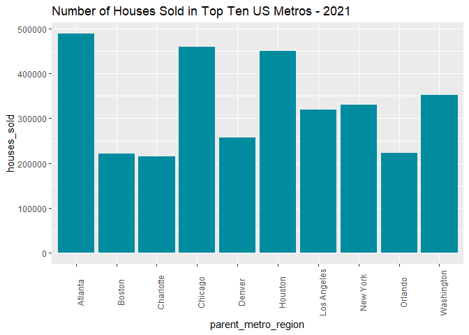

Hottest Housing Spots in the US Metropolitan Areas
================
2023-02-01


## Table of Content

1.  [SUMMARY](#SUMMARY)

2.  [DATA](#DATA)

3.  [ANALYSIS](#ANALYSIS)

4.  [CONCLUSION AND
    RECOMMENDATIONS](#CONCLUSIONS%20AND%20RECOMMENDATIONS)

## 1. SUMMARY

The Covid-19 pandemic has brought a lot of instability and
unpredictability to the housing market, and for the past four years, the
nation has gradually experienced a slight housing bubble; where sellers
have had much control over how much homes costs and sellers are left
with limited options. The sellers’ market reached its peak in late 2021,
but from June 2022, high property taxes have resulted in a gradual
slowdown.

For this project, I explore housing sales across the United States in
general to get a sense of the spatial distribution of the housing
market, and then zoomed in to the metropolitan areas, to analyze homes
sales between 2019 and 2022.

Research Questions:

- Which states had the highest and lowest number of houses sold between
  2019 and 2021, and how was housing sales for 2022?
- How have housing sales (The Number of Houses Sold) changed between
  2012-2022?
- How did the metropolitan areas perform in 2021 in Housing Sales?
- Which Metropolitan Areas had the highest and lowest number of homes
  sold in 2021?
- What was the housing preference type for investors and buyers?

## 2. DATA

### 2.1 About the Data and Preprocessing

I downloaded real estate data for all the metropolitan divisions of the
United States from REDFIN. The dataset consisted of monthly data on
housing for each of the metropolitan areas from 2012 to 2022. The data
is provided by Redfin, a national real estate brokerage, and it is open
to use with citation.

### 2.2.1 Excel

- I opened the data in Excel and explored it for data cleaning and
  subsequent analysis.
- I removed all unwanted columns, first. Since the dataset was very
  large, (591198 records), I removed all duplicates in the columns. I
  also fixed all structural errors.

#### 2.2.2 Big Query (SQL)

- After the excel clean-up and formatting, I imported the data into
  Big query, where I extracted the relevant data, aggregated, joined data
  and calculated fields to extract data needed for the analysis.

### 2.3 Load the Packages and library

``` r
options(repos = list(CRAN="C:/Program Files/R/R-4.2.2/library"))

install.packages("tidyverse")
install.packages("lubridate")
install.packages("ggplot2")
install.packages("plyr")
install.packages("tidyr")
install.packages("scales")
install.packages("dplyr")
install.packages("readr")
install.packages("magrittr")


library("tidyverse")
library("lubridate")
library("ggplot2")
library("tidyr")
library("scales")
library("plyr")
library("dplyr")
library("readr")
library("magrittr")
```

### 2.4 Import the Data

``` r
Housing_metro_2019 <-readr:::read_csv("C:/Users/cynta/OneDrive/Desktop/Project/post_covid_housing_trends/raw_data/Housing_Metro_2019.csv")


Housing_metro_2021 <-readr:::read_csv("C:/Users/cynta/OneDrive/Desktop/Project/post_covid_housing_trends/raw_data/Housing_Metro_2021.csv")
View(Housing_metro_2021)

Housing_metro_2022 <-readr:::read_csv("C:/Users/cynta/OneDrive/Desktop/Project/post_covid_housing_trends/raw_data/Housing_Metro_2022.csv")


Housing_metro_top10 <-readr:::read_csv("C:/Users/cynta/OneDrive/Desktop/Project/post_covid_housing_trends/raw_data/metro_top10.csv")

Housing_metro <-readr:::read_csv("C:/Users/cynta/OneDrive/Desktop/Project/post_covid_housing_trends/raw_data/metro_housing_type.csv")

Housing_years <-readr:::read_csv("C:/Users/cynta/OneDrive/Desktop/Project/post_covid_housing_trends/raw_data/years.csv")
```

### 2.5 Running Initial Statistics

``` r
Housing_2021_stats <- Housing_metro_2021 %>%
  summarise(average_homes_sold=mean(home_sold),
            average_sales_price=mean(sales_price),
            max_homes_sold=max(home_sold),
             min_homes_sold =min(home_sold),
            sd_homes_sold =sd(home_sold))
           View(Housing_2021_stats)
     
glimpse(Housing_2021_stats)
```

    ## Rows: 1
    ## Columns: 5
    ## $ average_homes_sold  <dbl> 21502.44
    ## $ average_sales_price <dbl> 17741785
    ## $ max_homes_sold      <dbl> 489045.6
    ## $ min_homes_sold      <dbl> 2
    ## $ sd_homes_sold       <dbl> 58349.82

### 2.6 Grouping the Homes Sold column into 4 Categories

- I grouped the metropolitan areas based on the number of homes sold
  into four groups for subsequent analysis.
- The average of homes sold for all metro areas is 21,502 homes, minimum
  was 2 and maximum was 370,376 homes, and standard deviation of
  58349.82. I segmented the data points into four, based on the data
  distribution. The first category, “low market” was all metro areas
  that had number of homes sold below the mean. Category “medium market”
  was one standard deviation above the mean, the third, “medium high
  market” was two standard deviations above the mean. The last category,
  “high market” was all other metros.

``` r
Housing_metro_2021<-Housing_metro_2021 %>%
  mutate (home_groups = case_when(
  home_sold < 21502 ~ "low market",
   home_sold >= 21502 &   home_sold < 79851 ~ "Medium Market",
    home_sold >=79851  &   home_sold < 101353 ~ "Medium High Market",
      home_sold >=101353~ "High Market"))
```

- I created a percent dataframe to standardize the distribution for the
  four categories.

``` r
Home_sold_percent <- Housing_metro_2021 %>%
  group_by(home_groups) %>%
  dplyr::summarise(total = n())%>%
  mutate(total_sold = sum(total)) %>%
  group_by(home_groups)%>%
  summarise(total_percent = total/total_sold)%>%
  mutate(labels = scales::percent(total_percent)) 


Home_Sold_Category = c("low market","Medium Market", "Medium High Market", "High Market")
Home_sold_percent2 <-cbind(Home_sold_percent, Home_Sold_Category)
View(Home_sold_percent2)
```

## 3. Analysis

### 3.1 Which states had the highest and lowest housing sales between 2019 and 2021?

- To initially get a general overview of the number of houses sold
  across the United States, I created maps in Tableau using the home
  sold column to spatially display the distribution of the number of
  homes sold at the state level.
  
  


  

  

  
  
  
  

- The first map above shows that for the period between 2019-2021, the
  states that experienced the highest percent housing sales included
  Alabama, Utah, Delaware, Connecticut South Carolina, Florida,
  Illinois, and New York. Some of lowest sales occurred in Montana,
  North Dakota, West Virginia. Wyoming had no data.

- When housing sales started declining into 2022, according to the second
  map, states such as Texas, Florida, California, New York, Georgia and
  Illinois topped the list in 2022.


### 3.2 How have Housing Sales (The Number of Houses Sold) Changed between 2012-2022?

``` r
Housing_years$Year<- as.Date(as.character(Housing_years$Year), format = "%Y")
options(scipen = 5)
ggplot(data = Housing_years) +geom_line(aes(x= Year, y = houses_sold), 
    color = "#008b9e", size = 1.5) + 
      labs(title = "Number of Houses Sold between 2012 and 2022")
```

<!-- -->

- The results showed that the housing market has seen a steady increase
  from 2012 to 2022. It peaked in 2021 and started declining late 2021
  into 2022.

### 3.3 How did the metropolitan areas perform in 2021 in Housing Sales?

- I used the grouped data of the Metropolitan Areas based on the number
  of houses sold for 2021 to create a pie chart.

``` r
ggplot(Home_sold_percent2, aes(x="",y=total_percent, fill=Home_Sold_Category)) +
  geom_bar(stat = "identity", width = 1)+
  coord_polar("y", start=0)+
  theme_minimal()+
  theme(axis.title.x= element_blank(),
        axis.title.y = element_blank(),
        panel.border = element_blank(), 
        panel.grid = element_blank(), 
        axis.ticks = element_blank(),
        axis.text.x = element_blank(),
        plot.title = element_text(hjust = 0.5, size=14, face = "bold")) +
  scale_fill_manual(values=c("#CCE6FF", "#3399FF", "#004D99" ,"#008b9e"))+  
  geom_text(aes(label = labels), position = position_stack(vjust = 0.5))+ 
  labs(title = "Housing Market Size for US Metropolitan Areas in 2021")
```

<!-- -->

- The results showed that majority of the metropolitan areas (82%) had a
  fairly good market (medium market) in 2021. 10% actually fell within
  the category of high market; while only 6% had a low market.

### 3.4 Which Metropolitan Areas had the highest and lowest number of homes sold in 2021?

- I selected the top 10 and bottom 10 ranking for the number of homes
  sold for the metropolitan areas.

``` r
top10<- top_n(Housing_metro_2021, 10, home_sold)

View(top10)

lowest10<- top_n(Housing_metro_2021, -10, home_sold)
```

``` r
options(scipen = 5)
ggplot(data = Housing_metro_top10) + geom_histogram(fill="#008b9e", 
    stat = "identity", aes(x = parent_metro_region, y= houses_sold))+
      theme(axis.text.x = element_text(angle = 90)) +
        labs(title="Number of Houses Sold in Top Ten US Metros - 2021")
```

<!-- -->


- Atlanta, GA came on top, followed by Chicago, IL. The rest included
  Houston, TX and Washington, DC. Metros that had the lowest number of
  homes sold include Selinsgrove, PA, Ruston, LA, West Point, MS and
  Bradford, PA (See Table below).
  
  
  
  


### 3.5 What was the housing preference type for investors and buyers?

``` r
ggplot(data = Housing_metro) +geom_bar(fill="#008b9e", aes(x = property_type)) + 
  theme(axis.text.x = element_text(angle = 90)) + 
    labs(title = "Property Type Among Investors and   Buyers") 
```

<!-- -->

- As expected, single-family residential properties were the most
  popular among buyers and investors in 2021. This was followed by
  condos and then townhouses.

## 4. Conclusions and Recommendations

- The steady progressing of the housing market, during and after
  covid-19 was spread across all regions of the United States. However,
  the peak of the market in 2022 concentrated more in the South, and to
  some extent the north-east.

- Majority of the metropolitan areas had a very good market overall by
  2021, with quite a good number selling more than 300,000 house. People
  were buying houses everywhere; this is when the housing market peaked.

- In 2022, when tax policies made it harder for more people to buy and
  property owners less willing to put their houses on the market, the
  southern states: Florida, Texas and California mostly still enjoyed a
  housing boom.

- Single family homes was the most preferred housing among buyers and
  investors, but condos also had an appreciable percentage. This is in
  line with realtor.com assertion that the “gleaming luxury condo towers
  with amenities like pools and swanky bars may monopolize the cool
  factor, but today’s pragmatic home buyers are clamoring for something
  different: affordable, single-family homes, often in the suburbs.”

- The housing market is gradually on a decline; however, this is not
  expected to be drastic, considering the extent to which housing sales
  are still high, though incomes have remained steady while cost of
  living keeps rising. This means that certain categories of people will
  be left out of the housing market, especially first time home buyers.
  It will be helpful for taxes to be adjusted so that people who need
  housing can afford.

- For the future, I plan to extend this study to include socio-economic
  data to better understand these trends, and to unravel the high
  housing market in places like, especially Texas, Florida, California,
  Georgia, New York and Illinois.
